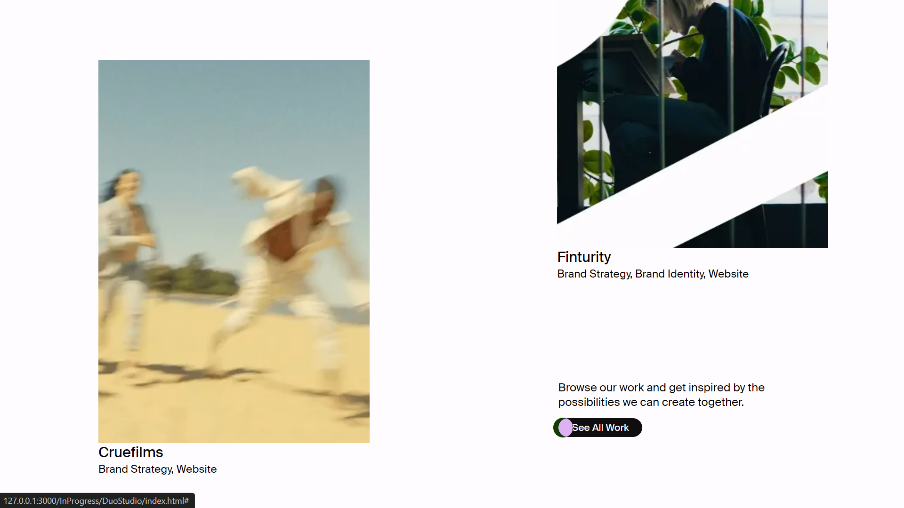

# Duo Studio

This is a cloned version of the [Duo Studio](https://duo-studio.co/) website, recreated for educational purposes and personal practice. The clone uses modern web technologies including Lenis, GSAP, and ScrollTrigger.

## Overview

This project aims to replicate the design and functionality of the Duo Studio website. It serves as a practice project to enhance skills in modern web development, animation, and smooth scrolling effects.

## Technologies Used

- **HTML5:** For structuring the web pages.
- **CSS3:** For styling the web pages.
- **JavaScript (ES6+):** For adding interactivity and dynamic content.
- **Lenis:** For smooth scrolling effects.
- **GSAP (GreenSock Animation Platform):** For advanced animations.
- **ScrollTrigger:** For creating scroll-based animations.

## Features

- **Smooth Scrolling:** Implemented using Lenis for a fluid user experience.
- **Animations:** Utilized GSAP and ScrollTrigger to recreate the animations seen on the original Duo Studio website.

## Some shots

 

 

